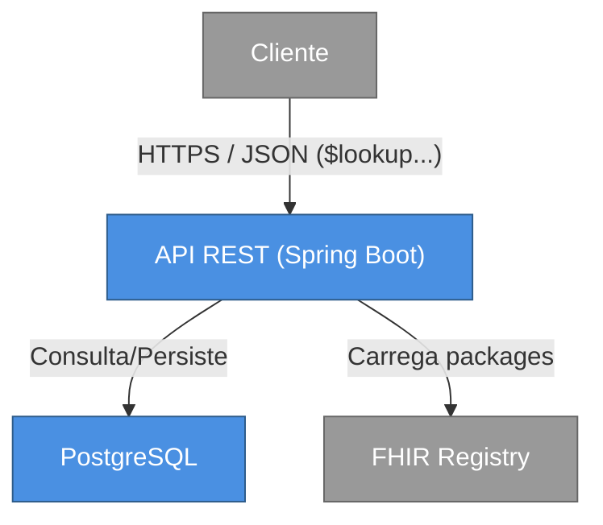

# Proposta 

O servidor é configurado com packages FHIR R4. A partir desses packages, ele monta um serviço de terminologia FHIR capaz de responder às operações de forma eficiente.

# Arquitetura

## Diagrama de Contexto

## Diagrama de Container

> Trabalho em andamento...
