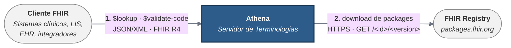
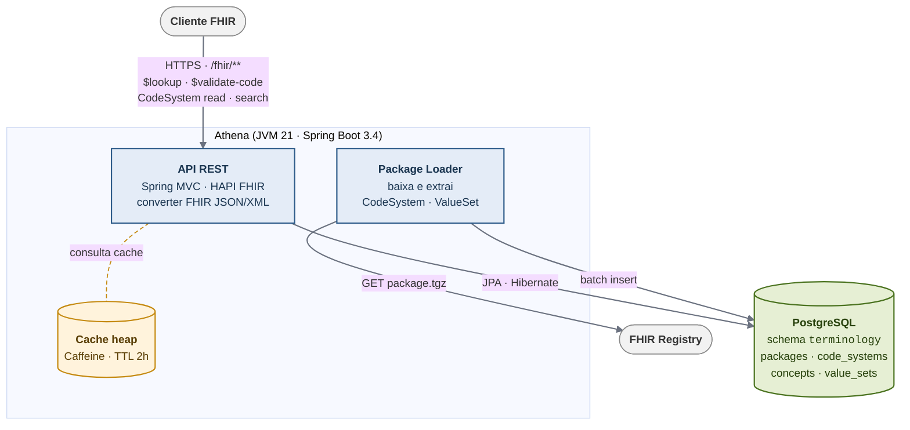

# Proposta — Arquitetura do Athena

O Athena é um servidor de terminologias FHIR R4 que carrega *packages* NPM FHIR (ex.: `hl7.terminology.r4`, `hl7.fhir.r4.core`), indexa CodeSystems/ValueSets/ConceptMaps em PostgreSQL e responde às operações padrão do serviço de terminologia definidas em [FHIR R4 Terminology Service](https://hl7.org/fhir/R4/terminology-service.html).

O objetivo de projeto é ser **simples e rápido**: nada de servidor HAPI completo; apenas Spring MVC + HAPI como modelo de recurso, tabelas desnormalizadas para `$lookup`/`$validate-code`, cache heap e virtual threads.

## Diagrama de contexto (quem fala com quem)

```mermaid
%%{init: {'theme':'base', 'themeVariables': {'fontFamily':'-apple-system, Segoe UI, sans-serif', 'fontSize':'13px'}}}%%
flowchart LR
    cliente(["<b>Cliente FHIR</b><br/><i>Sistemas clínicos, LIS,<br/>EHR, integradores</i>"])
    athena["<b>Athena</b><br/><i>Servidor de Terminologias</i>"]
    registry(["<b>FHIR Registry</b><br/><i>packages.fhir.org</i>"])

    cliente -- "<b>1.</b> $lookup · $validate-code<br/>JSON/XML · FHIR R4" --> athena
    athena -- "<b>2.</b> download de packages<br/>HTTPS · GET /&lt;id&gt;/&lt;version&gt;" --> registry

    classDef external fill:#f2f2f2,stroke:#8a8a8a,stroke-width:1px,color:#333
    classDef focus   fill:#2e5c8a,stroke:#1a3550,stroke-width:2px,color:#ffffff
    class cliente,registry external
    class athena focus
    linkStyle 0,1 stroke:#6b7280,stroke-width:1.5px
```

## Diagrama de container (o que roda dentro)

```mermaid
%%{init: {'theme':'base', 'themeVariables': {'fontFamily':'-apple-system, Segoe UI, sans-serif', 'fontSize':'13px'}}}%%
flowchart TB
    cliente(["<b>Cliente FHIR</b>"])
    registry(["<b>FHIR Registry</b>"])

    subgraph athena ["Athena (JVM 21 · Spring Boot 3.4)"]
        direction TB
        api["<b>API REST</b><br/>Spring MVC · HAPI FHIR<br/>converter FHIR JSON/XML"]
        loader["<b>Package Loader</b><br/>baixa e extrai<br/>CodeSystem · ValueSet"]
        cache[("<b>Cache heap</b><br/>Caffeine · TTL 2h")]
        api -. "consulta cache" .- cache
    end

    db[("<b>PostgreSQL</b><br/>schema <code>terminology</code><br/>packages · code_systems<br/>concepts · value_sets")]

    cliente -- "HTTPS · /fhir/**<br/>$lookup · $validate-code<br/>CodeSystem read · search" --> api
    api -- "JPA · Hibernate" --> db
    loader -- "GET package.tgz" --> registry
    loader -- "batch insert" --> db

    classDef external fill:#f2f2f2,stroke:#8a8a8a,stroke-width:1px,color:#333
    classDef component fill:#e4ecf7,stroke:#2e5c8a,stroke-width:1.5px,color:#1a3550
    classDef store     fill:#e6efd4,stroke:#4b7320,stroke-width:1.5px,color:#26400b
    classDef cacheStore fill:#fff3dc,stroke:#c58a11,stroke-width:1.5px,color:#5a3e05

    class cliente,registry external
    class api,loader component
    class db store
    class cache cacheStore
    linkStyle 1,2,3,4 stroke:#6b7280,stroke-width:1.5px
    linkStyle 0 stroke:#c58a11,stroke-dasharray:5 3,stroke-width:1.2px
```

## Fluxos principais

| Fluxo | Entrada | Processamento | Saída |
|---|---|---|---|
| **Carga na inicialização** | Lista de packages (`athena.packages.items`) | Baixa do registry OU lê local, extrai recursos FHIR via `.tgz`, persiste em `terminology.*` | Logs de carga com status `SUCESSO` / `ACOPLADO` / `IGNORADO` / `ERRO` |
| **`$lookup`** | `system` + `code` [+ `version`] | Consulta `concepts` (cache Caffeine na chave `system-code-version`); parseia `property` / `designation` do JSON | `Parameters` com `display`, `definition`, `property`, `designation` |
| **`$validate-code`** | `url` + `code` [+ `display`] | Mesma consulta do `$lookup`; compara `display` de forma leniente (case-insensitive, trim) | `Parameters` com `result` / `message` / `display` |
| **Metadata** | `GET /metadata` [`?mode=terminology`] | Devolve `CapabilityStatement` estático ou `TerminologyCapabilities` dinâmico construído a partir do banco | Recurso FHIR serializado |

## Princípios de design

- **Spring MVC puro**, sem `RestfulServer` do HAPI. HAPI é usado apenas como modelo de recurso (parser + classes FHIR R4) e como serializer via `FhirHttpMessageConverter`. Prefixo `/fhir` é aplicado automaticamente via `WebConfig.configurePathMatch`.
- **Tabelas desnormalizadas**. `concepts` replica `code_system_url`, `code_system_version` e `code_system_is_latest` para que `$lookup` faça uma única query por `(system, code)`.
- **Carga paralela** com virtual threads (Java 21) via `ExecutorService`. Cada CodeSystem numa transação própria (`TransactionTemplate`). Entre instâncias, concorrência resolvida por `DataIntegrityViolationException` no insert do `PackageEntity`.
- **Cache heap** com Caffeine (TTL 2 h) em `concepts` e `codeSystem`; invalidado explicitamente ao final da carga.
- **Conformidade FHIR R4** declarada em `CapabilityStatement` e `TerminologyCapabilities`; respostas de erro sempre como `OperationOutcome`.

## Estado atual e limitações conhecidas

Trabalho em andamento. O README lista as operações implementadas e pendentes; `docs/auditoria-senior.md` enumera dívidas técnicas e riscos priorizados. Duas limitações merecem destaque aqui:

- **Normalização de fragments de CodeSystem.** Múltiplos artefatos com mesma `url+version` e `content=fragment` são consolidados numa única row — `GET /CodeSystem/{id}` pode retornar o recurso incompleto do primeiro fragment, embora `$lookup`/`$validate-code` cubram todos os conceitos. Detalhes em `docs/plano-fragment-fix.md`.
- **`isLatest` por ordem de chegada.** A primeira versão a ser carregada para uma mesma URL é marcada como default; a lógica semântica (por `package.json.date` ou comparação SemVer) é trabalho futuro.
